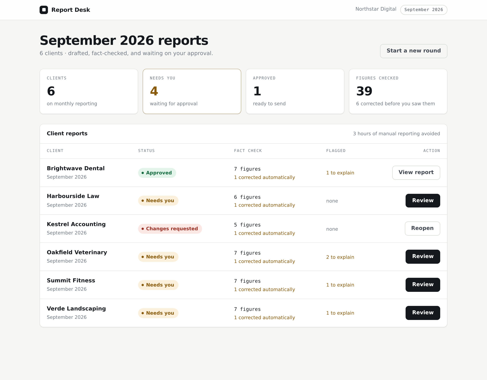
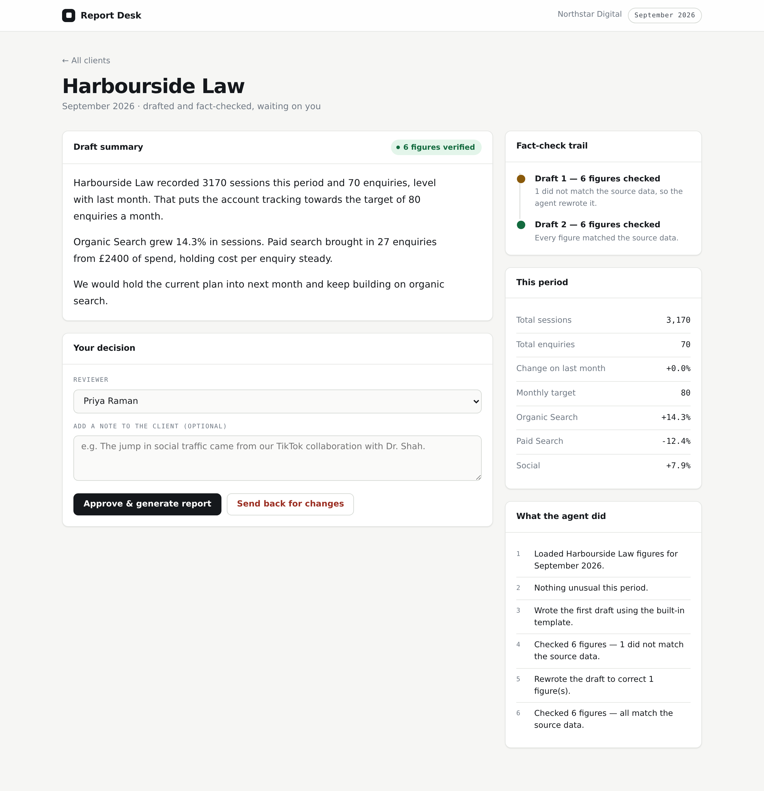

# Report Desk

Report Desk writes a marketing agency's monthly client reports from the
platform exports the agency already downloads, checks every figure in every
sentence against that data, flags unusual movements for a person to explain,
and waits for approval before a report exists.

- **Inputs:** GA4 Traffic acquisition, Google Ads campaign reports, Search
  Console performance exports and Meta Ads tables, as they download (CSV,
  Excel-CSV, Search Console zip), or any simple CSV, or figures typed in.
- **Output:** a branded HTML report and an A4 PDF in the agency's name, logo
  and colour. Report Desk itself never appears on it.
- **The promise:** no figure reaches a client unless it matches the data, or a
  named person has checked it and confirmed it (which is logged).



---

## What happens each month

1. **Upload.** For each client, upload that month's exports (or let the
   demo agency show you). Each file is read in its real format, and the
   checks happen on upload: wrong month, two months in one file, an Excel file
   instead of CSV, a Search Console export without the dates file, and an
   incomplete month all come with a plain-English explanation.
2. **Combine.** Sources are merged by rule: GA4 owns sessions, conversions
   and revenue; ad platforms own spend; figures typed in by hand override
   everything. When sources disagree by more than 5% (Google Ads conversions
   vs GA4, for example) the reviewer is told which figure was used.
3. **Fact sheet.** Every figure the report may state is computed: each
   channel's levels, month-on-month and year-on-year changes, differences,
   shares of the total, cost per conversion, conversion rate, ROAS, and
   progress against target. Each one gets an ID.
4. **Unusual movements.** Large swings with enough volume behind them are
   flagged: a channel that stopped (a paused Meta campaign), a spike, a drop,
   a target miss. Small-number noise (1 booking becoming 2) is ignored.
5. **Draft.** The template writer (free, no key) or Claude writes the
   narrative, citing a fact ID after every figure.
6. **Fact check.** Every figure in the draft is read the way a client reads
   it: *which channel, which metric, which month, which direction, and is it
   a level, a change, a share or a target.* "Organic search delivered 143
   enquiries" fails if 143 was paid search. "Sessions rose 8.6%" fails if
   they fell 8.6%. "Social drove 20 enquiries this month" fails if 20 was
   last month. If Claude got something wrong, it gets the exact sentences back
   and rewrites only those (up to three drafts), then a person sees the result.
7. **Review.** The reviewer sees the draft with every checked figure
   underlined (hover for its source) and any problem highlighted with the
   correct figure. They can edit (re-checked instantly), add explanations for
   unusual movements and next month's plans, ask Claude for changes, reject
   for this month, or approve.
8. **Report.** Approval renders the branded report and PDF as a new version.
   Everything (uploads, drafts, edits, approvals, confirmed figures) is in the
   activity log.



---

## Try it in two minutes

```bash
pip install -r agency_report_agent/requirements.txt
python -m playwright install chromium          # for PDF export
python -m agency_report_agent.web               # http://127.0.0.1:8000
```

Sign in with any name (no password is needed on your own computer), then
choose **Load the demo agency** and **Draft 12 reports**.

The demo agency, Northstar Digital, has twelve clients built to exercise what
a real month throws at you: a full GA4 + Ads + Search Console + Meta stack, a
law firm whose Google Ads conversions disagree with GA4, an accountant with
no paid media, a vet whose Meta campaign was paused, an e-commerce shop with
revenue and ROAS, a brand-new client with no history, a GA4 export with the
old "Conversions" header and a UTF-16 Excel export from Google Ads, a car
dealer with six-figure traffic, and a yoga studio with single-digit bookings.

---

## Running it for a team

```bash
export REPORT_DESK_PASSWORD='a long team password'
export REPORT_DESK_HOME=/srv/report-desk              # where all data lives
export ANTHROPIC_API_KEY=...                          # optional: lets Claude write drafts
python -m agency_report_agent.web --host 0.0.0.0 --port 8000
```

- Put it behind HTTPS (Caddy, nginx, or your host's proxy) and set
  `REPORT_DESK_SECURE_COOKIES=1`.
- Without `REPORT_DESK_PASSWORD` the app refuses to listen on the network.
- Everyone signs in with their own name and the team password; names are
  recorded against every action.
- **Back up `REPORT_DESK_HOME`.** It holds the clients, every uploaded file,
  approved reports, the activity log and in-progress reviews (which survive
  restarts).

### Claude or the template writer

Settings → *Who writes the first draft*.

| | Template writer | Claude |
|---|---|---|
| Cost | Free | Pay per draft through your Anthropic account |
| Needs | Nothing | `ANTHROPIC_API_KEY` on the server |
| Reads like | Clear, consistent, a little formulaic | Your best account manager, in your house voice |
| Explains movements | Uses the reviewer's explanations | Uses the client context and reviewer's explanations |
| "Make it shorter", etc. | No (edit the text directly) | Yes |
| Fact checked | Yes | Yes, and rewritten until it passes (max 3 drafts) |

The model can be chosen in Settings: Claude Opus 5.5 (best writing), Sonnet
5.5 (balanced) or Haiku 4.5 (fastest and cheapest). If Claude is unavailable
for any reason (no key, an outage, a refusal), the template writer drafts that
report instead and the review screen says why.

---

## Where each export comes from

| Platform | Export |
|---|---|
| GA4 | Reports → Acquisition → **Traffic acquisition**, date range = the month → Share → Download CSV |
| Google Ads | **Campaigns**, date range = the month → Download → CSV (or Excel .csv) |
| Search Console | Performance → Search results → date = the month → Export → Download CSV (zip) |
| Meta Ads | Ads Manager → **Campaigns**, the month → Reports → Export table data → CSV |
| Anything else | A CSV with `channel` plus any of `sessions, conversions, spend, revenue, clicks, impressions`, or `channel, metric, value` (optional `period` column) |

---

## Command line

```bash
python -m agency_report_agent demo                                   # load the demo agency
python -m agency_report_agent import seaview-physio 2026-09 ga4 traffic.csv
python -m agency_report_agent draft 2026-09                          # draft every client with data
python -m agency_report_agent status 2026-09
python -m agency_report_agent check seaview-physio 2026-09 draft.md  # fact-check any text
```

`check` is useful on its own: paste in a report your team wrote by hand and it
lists every figure that doesn't match the data.

---

## How it's built

```
importers/      real export formats → figures per channel and month
store.py        the workspace: clients, sources, merge rules, reports, audit log
facts.py        the fact sheet: every allowed figure, with an ID
anomalies.py    unusual movements (arithmetic only)
drafting.py     the template writer
llm.py          the Claude writer (official Anthropic SDK)
verify.py       the claim-level fact checker
graph.py        the LangGraph agent: load → facts → draft ⇄ check → review → render
desk.py         runs the agent per client and month; parallel drafting; persistence
render.py       the branded report and PDF
web/            the app the team uses
```

The agent is a LangGraph state machine with a SQLite checkpointer. It pauses
at review with `interrupt()` and resumes with the reviewer's decision, so a
report waiting for approval survives a restart, and two people clicking
Approve at once produce one report.

## Tests

```bash
python -m pytest agency_report_agent/tests -q
```

About 400 tests, including:

- every export of every demo client and month imported and compared with
  ground truth computed independently of the importers;
- every fact of every demo client written out as a sentence, true (must pass)
  and mutated with the wrong number, channel, direction or month (must be
  caught): about 7,000 checks;
- hand-written account-manager prose, true and subtly wrong;
- the Claude writer through the real SDK against a local stand-in of the API:
  overloads and retries, refusals, truncation, bad keys, rewrite loops;
- a full agency month over HTTP: 12 clients created through the forms, every
  file uploaded, every report drafted and approved, and every figure in every
  report table, tile and PDF compared with the ground truth.

## Limits, honestly

- The fact checker understands numbers in context (channel, metric, month,
  direction, kind). It doesn't judge claims without numbers beyond direction
  ("paid search sessions dropped"), and it can't know whether an explanation
  is true: explanations come from the reviewer or the client context, and a
  person approves every report.
- Monthly reporting only (calendar months). Weekly or custom ranges are not
  supported yet.
- Exports are uploaded by hand. Direct connections to GA4, Google Ads and
  Meta are the next step; the importers and everything after them won't
  change when they arrive.
- One team password per installation; no per-client permissions yet.

---

## Deploying

Report Desk keeps its data on disk (uploads, approved reports, SQLite review state) and prints PDFs with
Chromium, so it needs a host with a **persistent volume** — a Fly.io/Railway/Render service or a small VPS.
It does not run inside a Cloudflare Worker, and a Cloudflare Container's disk is wiped on restart.

```bash
docker build -t report-desk .
docker run -p 8000:8000 -v report-desk-data:/data \
  -e REPORT_DESK_PASSWORD='a long team password' \
  -e ANTHROPIC_API_KEY=...            `# optional` \
  -e REPORT_DESK_TRUSTED_PROXIES='*'  `# only when it sits behind your proxy/tunnel` \
  report-desk
```

Put Cloudflare in front for HTTPS: either proxy the host's DNS record through Cloudflare, or run
`cloudflared` (Cloudflare Tunnel) beside the container, and optionally add a Cloudflare Access policy so only
your team's email addresses can reach the login page. Back up the `/data` volume.
