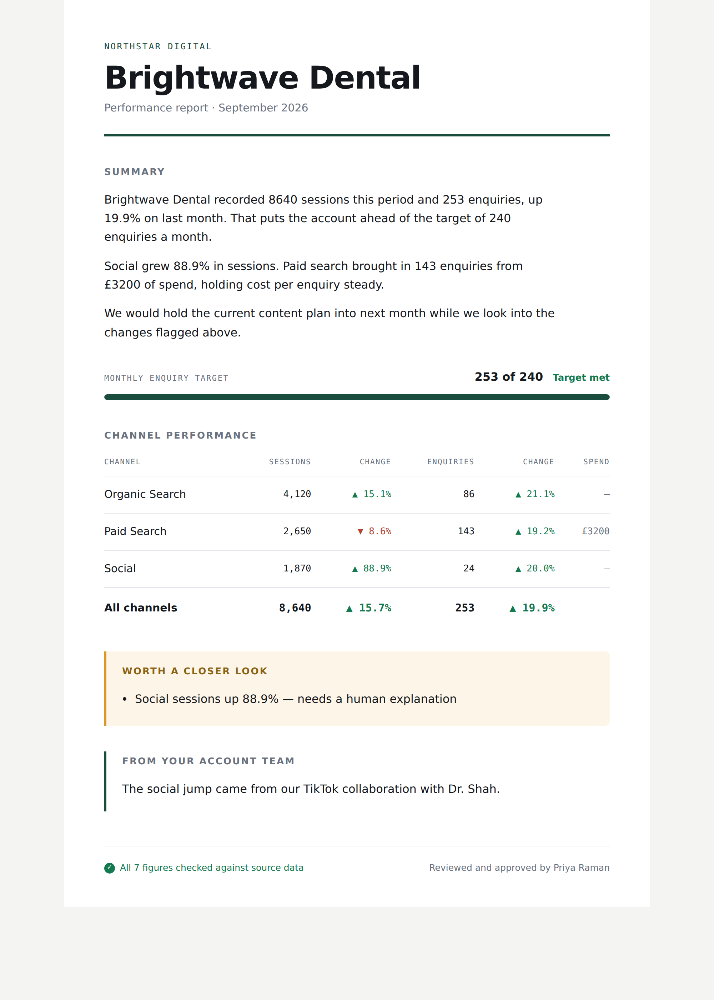

# Report Desk

An AI agent that writes a marketing agency's monthly client reports, checks
every figure it wrote against the real data, flags anything unusual for a
human, and waits for approval before a single report goes out.

Built with **LangGraph** (the agent) and **LangChain** (the writing), with a
web app the agency actually uses.

**It runs for free, with no API key.** You can see the whole thing working in
about two minutes.


---

## The one-line version

> It writes your monthly client reports, double-checks its own numbers, and
> waits for your approval before anything goes out.

## What happens, in plain English

Every month, the agent pulls each client's figures, writes the report summary,
then checks every number it just wrote against the real data. If it got one
wrong, it rewrites that part and checks again. Anything unusual — like social
traffic nearly doubling — it flags for the agency to explain, because only they
know why. Then it stops and waits: nothing reaches a client until someone reads
it and clicks approve.

---

## Run it (free, about 2 minutes)

```bash
pip install langgraph langgraph-checkpoint-sqlite fastapi uvicorn jinja2 python-multipart
python -m agency_report_agent.web
```

Open **http://127.0.0.1:8000**, tick **Demo the fact-check**, and press
**Run 6 reports**.

Ticking that box plants one wrong figure in each first draft on purpose, so you
can watch the agent catch it and correct itself. Open any client and look at the
**Fact-check trail** — that is the part worth recording for a demo video.

| Screen | What it is |
|---|---|
|  | **Review** — the draft, the fact-check trail, and the things only a human can explain |
|  | **The report** — what the agency sends, in the agency's own brand |

### Command line instead

```bash
python -m agency_report_agent.cli --demo-glitch      # draft and fact-check all clients
python -m agency_report_agent.cli --approve-all      # also approve and produce the reports
python -m agency_report_agent.cli --start-over       # begin a fresh round
```

### The quality checks you show a client

```bash
python -m agency_report_agent.tests.run_evals
```

This proves four things: it spots made-up figures, it always stops for a human,
rejecting a draft really does stop it, and it corrects its own mistakes. A
passing sheet answers the question every prospect actually has — *can I trust
what it writes?*

### Live mode, with Claude writing the drafts

```bash
pip install langchain-anthropic python-dotenv
cp agency_report_agent/.env.example agency_report_agent/.env   # add your API key
REPORT_DESK_LIVE=1 python -m agency_report_agent.web
```

One report costs well under a cent. The default model is `claude-opus-5-5`; set
`AGENT_MODEL=claude-haiku-4-5` in `.env` to cut that by roughly 20x.

---

## How it is built

The agent is a **graph**, not a script: it can go backwards, take different
paths, and pause mid-run to wait for a person.

```
 fetch_data ──(got the data?)──> detect_anomalies ──> draft_commentary
     │  ▲ no                                                │
     └──┘ retry (max 2)                                     ▼
                                                     verify_numbers
                                                      │          ▲
                   (every figure correct?) no, rewrite│          │  loop, max 3
                               ┌──────────────────────┘          │
                               ▼                                 │
                        draft_commentary ────────────────────────┘
                               │ yes
                               ▼
                        human_approval   ← the run PAUSES here, saved to disk
                               │
                    approved   │   sent back for changes
                       ┌───────┴────────┐
                       ▼                ▼
                render_report          stop
```

| Step | What it does | Why it is built this way |
|---|---|---|
| `fetch_data` | Loads the client's figures | Everything downstream must be grounded in real data. Retries, because real data sources fail. |
| `detect_anomalies` | Flags swings over 40% | **Plain arithmetic, no AI** — a rule is enough, and code cannot hallucinate. |
| `draft_commentary` | Writes the summary | The only step that uses AI, because this is the only step needing judgement. |
| `verify_numbers` | Checks every figure against the source | **Plain arithmetic again.** A wrong figure in a client report is the worst thing this product could do. |
| `human_approval` | Pauses for a person | The agency's name is on the report. Nothing is sent without a human. |
| `render_report` | Builds the branded report | The data table is built **from the source data, never from the AI's text**, so the numbers are always exactly right. |

The guiding principle: **use AI only where judgement is needed, and plain code
wherever rules are enough.** Three of the five working steps use no AI at all.

### Files

| File | What it holds |
|---|---|
| `graph.py` | The graph: the steps, the loop, the branches |
| `nodes.py` | What each step actually does |
| `state.py` | The shared record that travels between steps |
| `metrics.py` | The arithmetic and the fact-checking rules |
| `llm.py` | The only place Claude is called |
| `render.py` | The branded client report |
| `batch.py` | Running every client and tracking each one |
| `web/` | The app: dashboard, review screen, report viewer |
| `tests/` | The quality checks |

---

## Honest limitations

- **Data comes from JSON files**, not live GA4 / Search Console. Connecting
  those is the next build, and must run on the agency's own credentials.
- **The fact-checker** validates figures from the data, month-on-month changes
  and conversion rates. A draft citing some other derived metric gets flagged;
  add it to the allowed sets in `metrics.py` if you want it permitted.
- **Approval happens in this app.** Moving it into Slack is a natural next step.
- **The "hours saved" figure** assumes roughly 3 hours per client per month,
  which came from vendor case studies. Check it against the agency's real
  numbers before quoting it to them.
- **This is a working demo, not audited production software.** Before a paying
  client goes live: run a security review, keep every credential on the
  client's own accounts, and set a spend cap on the API key.
